# SafeHer 🛡️ — Premium Women's Safety & Emergency Response PWA

SafeHer is a production-grade, highly polished Progressive Web Application (PWA) designed to provide instant security, high-accuracy real-time location sharing, and smart danger detection triggers. With a stunning glassmorphic UI, fluid animations, and a multi-layered local-first fallback architecture, SafeHer is fully optimized to serve as a reliable safety net in critical situations.

---

## 🌟 Key Features & Product Pillars

### 1. The SOS Emergency Hub
* **Hold-to-Activate Trigger**: A prominent, animated center button requires a 3-second hold to trigger (preventing false alarms) with a countdown ring.
* **Haptic Morse-Code Vibration**: Emits rhythmic SOS vibration pulses using the Web Vibration API.
* **Local Siren & Recording**: Sounds an attention-grabbing alarm and triggers background ambient audio recording immediately.
* **Emergency Overlay Mode**: Locks the UI into a high-visibility, high-contrast critical dashboard.

### 2. Continuous Live Geolocation Tracking
* **Real-time GPS Watcher**: Hooks into `navigator.geolocation.watchPosition` to monitor precise movements under high-accuracy settings.
* **Firestore Syncing**: Updates active coordinates to Firebase Firestore every 5 seconds.
* **Public SOS Portal (`/sos-portal/:alertId`)**: Generates a secure, shareable live-tracking link. Trusted contacts can click the link (no sign-up required) to view:
  - The victim's real-time position on an interactive map.
  - A breadcrumb path showing movement history.
  - Live dispatch logs (e.g., "Emergency Triggered", "Twilio Alert Sent").
* **Bidirectional Acknowledgment**: When a contact views the portal or taps "Acknowledge", their status updates in real-time. The victim's device immediately plays a reassuring audio chime and flashes a notification showing their contact's name.

### 3. Smart Detection Suite
* **Shake-to-Alert**: Monitors device accelerometers using the DeviceMotion API. A high-impact shake triggers a 5-second countdown with warning chirps before sending an SOS.
* **Rapid Keystroke Trigger**: Rapidly pressing `Space` or `Escape` 3 times in 2 seconds starts the emergency dispatch overlay.
* **Inactivity Check-in**: Set an inactivity timer (e.g., "Walking home alone for 10 minutes"). If the user fails to check-in with their PIN (default: `1234`) before the timer expires, an automatic SOS is dispatched.

### 4. Interactive Tools & Companion
* **AI Safety Companion**: A glassmorphic chatbot powered by safety and de-escalation models that provides immediate safety advice, interactive guidance, and voice answers.
* **Fake Call Simulator**: Lets users schedule simulated incoming phone calls with custom contact names, timers, and synthetic call voices to help them gracefully escape uncomfortable situations.
* **Embedded Safe Zones**: Locate nearby Police Stations, Hospitals, and Women Safety Centers directly in the app.
  - *Google Maps JS SDK Integration*: Pins resources on an interactive map with precise distance calculations.
  - *Smart Radar Fallback*: If the Google Maps API key is missing or offline, the page dynamically draws a stunning radar-sweep visual on canvas, letting users select nearby mock safety resources and trigger external navigation separately.

### 5. Administrative Shield & Logs
* **Expandable Incident Timeline**: Detailed event ledger recording starting coordinates, resolve times, and playbacks of emergency audio recordings.
* **Evidence Reporting**: Form allowing users to submit incident reviews, upload photos (Firebase Storage), record statements, and save metadata.
* **Authority Dashboard**: A secure portal for administrators to oversee active emergencies, analyze statistics, and review uploaded incident evidence.

---

## 🛠️ Architecture & Data Flow

```mermaid
sequenceDiagram
    participant User as Victim/User
    participant App as SafeHer Frontend
    participant FS as Cloud Firestore
    participant Storage as Firebase Storage
    participant Portal as Trusted Contact Portal

    User->>App: Triggers SOS (Manual hold / Shake / Timer)
    activate App
    App->>App: Start Siren & Record Audio (MediaRecorder)
    App->>FS: Create Active Emergency Session in `sos_alerts`
    FS-->>App: Return Alert ID
    
    rect rgb(30, 30, 40)
        Note over App, FS: Real-time Live Tracking Loop
        loop Every 5s
            App->>FS: Write high-accuracy coordinates to `breadcrumbs`
        end
    end

    App->>User: Share Public Tracking Link
    Note over Portal, FS: Trusted Contact views Tracking Link
    Portal->>FS: Subscribe to Alert ID & Coordinates
    FS-->>Portal: Push live breadcrumbs (Updates canvas path)
    Portal->>FS: Tap "Acknowledge" (Updates contact status)
    FS-->>App: Push Acknowledgment Status
    App->>User: Play Synthesized Chime & Alert Banner

    User->>App: Cancel / Resolve SOS
    App->>App: Stop Siren & Stop Geolocation Watcher
    App->>Storage: Upload recorded audio evidence
    Storage-->>App: Return Secure Download URL
    App->>FS: Update main alert (audio URL, status = 'resolved')
    deactivate App
```



---

## 💻 Tech Stack

* **Frontend Framework**: React 18, Vite (Fast builds & Asset optimization)
* **Styling**: Tailwind CSS (Dark premium aesthetic, customized glassmorphic panels)
* **Icons & UI Assets**: Lucide Icons, Custom PWA Vector Assets
* **Backend Platform**: Firebase (v10 SDK)
  - *Authentication*: Firebase Auth (Anonymous & Phone sign-in support)
  - *Database*: Cloud Firestore (Real-time sync listeners, subcollections for tracking breadcrumbs & logs)
  - *Storage*: Firebase Cloud Storage (Resumable audio evidence and incident photo uploads)
* **PWA Engine**: Service Worker (v2 Cache-first strategy, custom offline fallback shell, dynamic installation banner)
* **APIs & SDKs**:
  - *Google Maps Javascript API*: Vector maps, advanced markers, and distance calculations.
  - *Web Speech API & Web Audio API*: Sound synthesis, audio oscillators, and voice recognition/triggers.

---

## ⚙️ Project Configuration & Installation

### 1. Prerequisites
Ensure you have [Node.js](https://nodejs.org/) installed (v18+ recommended).

### 2. Setup Guide
Clone this repository and navigate to the project folder:
```bash
git clone https://github.com/Hack-M/women-sefty.git
cd women-sefty
```

Install dependencies:
```bash
npm install
```

### 3. Environment Variables
Create a `.env` file in the root directory by copying the example:
```bash
cp .env.example .env
```

Open `.env` and fill in your credentials:
```env
VITE_FIREBASE_API_KEY=your_firebase_key
VITE_FIREBASE_AUTH_DOMAIN=your_project.firebaseapp.com
VITE_FIREBASE_PROJECT_ID=your_project_id
VITE_FIREBASE_STORAGE_BUCKET=your_project.appspot.com
VITE_FIREBASE_MESSAGING_SENDER_ID=your_sender_id
VITE_FIREBASE_APP_ID=your_app_id

# Optional - Maps Integration
VITE_GOOGLE_MAPS_KEY=your_google_maps_api_key
```

> [!NOTE]
> **Zero-Crash Resiliency (Demo Mode)**: If no environment variables are defined or Firebase is unreachable, SafeHer will automatically enter **Demo Mode**. All features (live tracking, portal coordination, audio storage simulation, and nearby radar maps) will operate seamlessly in local state to ensure a flawless presentation.

### 4. Running Locally
Launch the Vite development server:
```bash
npm run dev
```

### 5. Production Build
Optimize the application bundle for production:
```bash
npm run build
```
Vite will output highly optimized, chunk-split code splitting Firebase and React libraries into independent vendor files for extremely fast loading times on mobile devices.

---

## 🔐 Security & Firestore Rules

To ensure victim privacy and secure data sharing, Firestore uses strict, context-aware security rules defined in `firestore.rules`:
1. **Public Emergency Access**: Anyone can read an active `sos_alerts` document and its `breadcrumbs` subcollection *only if* the alert status is set to `active`.
2. **User Isolation**: Incident reports and private profiles can only be written or read by the authenticated creator (`request.auth.uid == resource.data.uid`).
3. **Admin Privilege**: Only authenticated users with custom admin claims can access the global metrics or retrieve audio/photo resources from Firebase Storage.

---

## 🏆 Hackathon Ready Highlights
* **Progressive Web App**: Easily installable on iOS and Android straight from the browser. Supports offline safety tips caching.
* **No Broken APIs**: Handled permission denials, offline states, and empty credentials gracefully with premium animated mockups.
* **Sound Design**: Integrated synthesized warning tones and Morse vibration for high-sensory guidance during crises.
