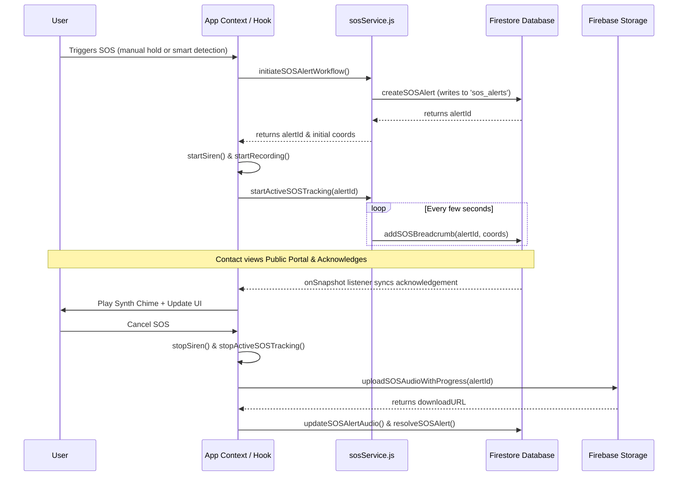

# SafeHer SOS System Architecture

This document outlines the technical details and architecture of the SafeHer SOS emergency system, explaining how the client, Firebase services, and local simulators work together to create a reliable safety net.

---

## 1. SOS Event Lifecycle



---

## 2. Technical Component Breakdown

### A. Geolocation & Continuous Path Tracking
- **Initial Coordinates**: Fetched instantly using `getCurrentPosition` with high accuracy.
- **Continuous Tracking**: Utilizes `watchPosition` inside `sosService.js`. Each coordinate update:
  1. Writes to `live_locations/{userId}` for active global tracking.
  2. Creates a document under `sos_alerts/{alertId}/breadcrumbs` to log path history.
  3. Updates the `location` field on the main `sos_alerts/{alertId}` document for quick map rendering.
- **Breadcrumb Rendering**: The public portal `/sos-portal/:alertId` listens to this subcollection and dynamically draws the coordinate history on an HTML5 `<canvas>` as a fluorescent pathway, updating in real-time.

### B. Audio Evidence Capture & Storage Upload
- **Local Capture**: MediaRecorder API captures audio statement as a `.webm` stream using a local buffer.
- **Resumable Upload**: Upon emergency cancellation, `uploadSOSAudioWithProgress` invokes `uploadBytesResumable` from Firebase Storage.
- **Progress Tracking**: Progress percentages are piped directly back to the active SOS UI showing a progress bar.
- **Firestore Metadata Linking**: Once upload completes, `updateSOSAlertAudio` saves the audio URL and size/duration metadata onto the emergency document and writes a log event.

### C. Smart Emergency Detection
- **Shake Detection**: Listens to the `devicemotion` window event. When acceleration exceeding `800` (threshold force) is detected, it triggers a 5-second countdown with warning beeps.
- **Power Keystroke**: Listens to `keydown` on window. 3 clicks of `Space` or `Escape` keys in 2 seconds starts the warning overlay.
- **Inactivity Timer**: A countdown timer (e.g. walking home). When expired, triggers a PIN input check-in modal. If PIN `1234` is not entered within 15 seconds, the emergency activates.

### D. Trusted Circle Real-time Sync
- **Public Portal Route**: `/sos-portal/:alertId` is public (unauthenticated) so contacts receiving emergency SMS/messages can click and track instantly.
- **Real-time subscriptions**: Portal subscribes to `sos_alerts/{alertId}`, `breadcrumbs`, and `logs` using Firestore `onSnapshot`.
- **Bidirectional Acknowledgment**: 
  - When the contact views the page, their status in the `contacts` array is updated to `'viewed'`.
  - When they click "Acknowledge", their status updates to `'acknowledged'`, and a log event is created.
  - The victim's device receives this document snapshot in real-time, displays their contact's name, and plays a synthesized alert chime using Web Audio API nodes.

---

## 3. Firestore Schema Models

### Main Document: `sos_alerts/{alertId}`
```json
{
  "uid": "string",
  "status": "active | resolved",
  "location": {
    "latitude": "number",
    "longitude": "number",
    "accuracy": "number"
  },
  "contacts": [
    {
      "name": "string",
      "phone": "string",
      "status": "sent | viewed | acknowledged"
    }
  ],
  "audioUrl": "string (optional)",
  "audioMetadata": {
    "sizeBytes": "number",
    "durationSeconds": "number"
  },
  "timestamp": "Timestamp",
  "resolvedAt": "Timestamp (optional)"
}
```

### Subcollection Document: `sos_alerts/{alertId}/breadcrumbs/{crumbId}`
```json
{
  "latitude": "number",
  "longitude": "number",
  "accuracy": "number",
  "timestamp": "Timestamp"
}
```

### Subcollection Document: `sos_alerts/{alertId}/logs/{logId}`
```json
{
  "event": "string (e.g. 'Emergency Triggered', 'PCR-32 Dispatched')",
  "location": "object (optional)",
  "details": "object (optional)",
  "timestamp": "Timestamp"
}
```
